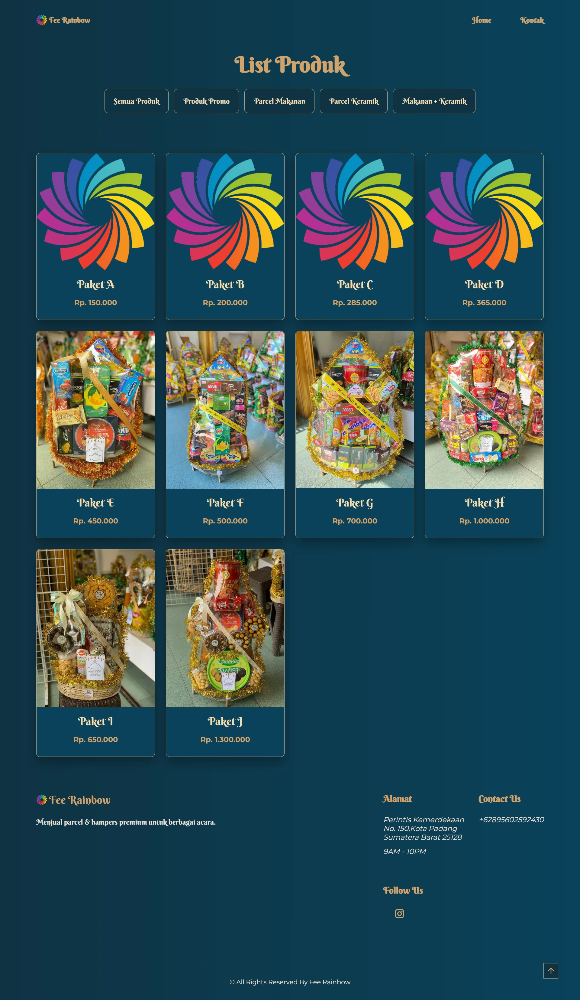

<h1 align="center">🎁 Katalog Parcel Fee Rainbow</h1>

<p align="center">
  Website katalog parcel premium berbasis HTML, CSS, dan JavaScript.
  <br/>
  Memudahkan pelanggan melihat produk dan melakukan pemesanan langsung via WhatsApp.
</p>

<p align="center">
  <a href="https://salahketik.github.io/katalog-parcel/">🌐 Live Demo</a>
  •
  <a href="https://github.com/salahketik/katalog-parcel">📦 Repository</a>
</p>

<p align="center">
  
</p>

<p align="center">
  
  
  
</p>

---

## 📸 Preview

<p align="center">
  
</p>

---

## 🎯 Why This Project?

Project ini dibuat untuk membantu bisnis parcel / hampers
menampilkan katalog produk secara online dengan tampilan modern,
tanpa perlu menggunakan marketplace.

---

## ✨ Fitur Utama

- 📱 Responsive Design (Mobile Friendly)
- 🔎 Filter produk berdasarkan kategori
- 🪟 Modal detail produk
- ⬆️ Scroll to top button
- 💬 WhatsApp direct order
- 🎨 UI modern dengan CSS Variables

---

## 🛠 Tech Stack

- HTML5
- CSS3
- JavaScript (Vanilla JS)

---

## 📂 Struktur Folder

```
katalog-parcel/
│
├── index.html
├── README.md
│
├── assets/
│   ├── css/
│   │   └── styles.css
│   │
│   ├── js/
│   │   ├── data.js
│   │   └── index.js
│   │
│   └── img/
│       ├── logo.png
│       └── product/
```

---

## 🚀 Cara Menjalankan Project

1. Clone repository

```bash
git clone https://github.com/salahketik/katalog-parcel.git
```

2. Masuk ke folder project

```bash
cd katalog-parcel
```

3. Buka file `index.html` di browser

Atau gunakan **Live Server** di VS Code.

---

## 🌍 Deploy ke GitHub Pages

1. Masuk ke repository GitHub
2. Klik **Settings**
3. Pilih **Pages**
4. Pilih branch: `main`
5. Klik Save

Website akan aktif di:

https://salahketik.github.io/katalog-parcel/

---

## 🔮 Future Improvements

- [ ] Shopping Cart
- [ ] Search Feature
- [ ] Admin Dashboard
- [ ] Backend Integration
- [ ] Payment Gateway

---

## 📞 Kontak

WhatsApp:  
https://wa.me/62895602592430

---

## ⭐ Support

Jika kamu suka project ini, jangan lupa beri ⭐ di GitHub!

---

## 📄 License

This project is licensed under the MIT License.

---

## 👨‍💻 Author

<p align="center">
  Crafted with ❤️ by <strong>SalahKetik</strong><br/>
  Frontend Developer & Content Creator<br/><br/>
  <a href="https://github.com/salahketik">GitHub</a> • 
  <a href="https://instagram.com/salahketikan">Instagram</a>
</p>
